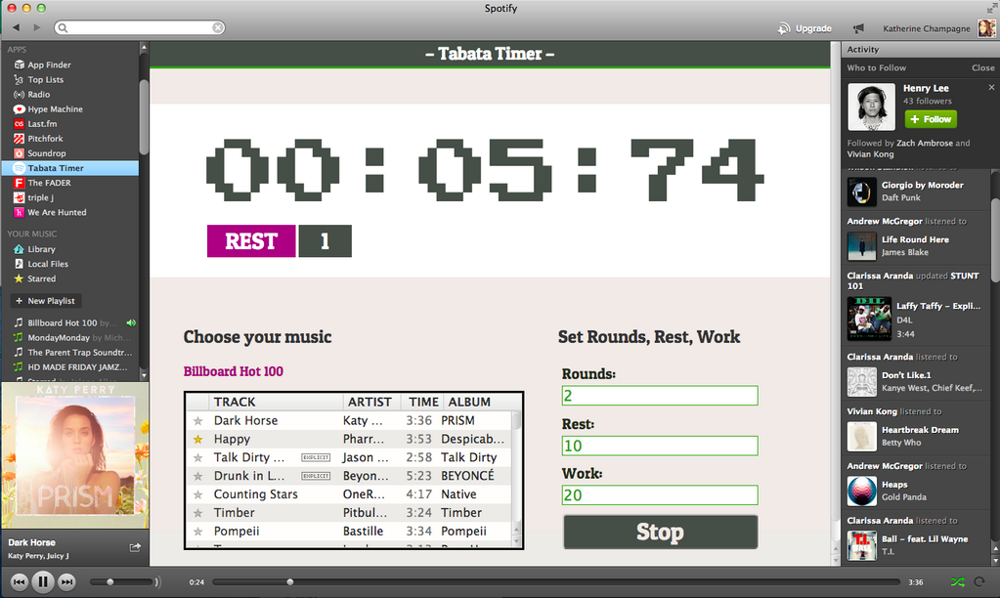

# Spotify Tabata Timer
###### *also known as HIIT 'EM UP STYLE*

A [Tabata Timer](http://www.huffingtonpost.com/tony-desantis/tabata-training_b_4804490.html) Spotify app that adjusts music playback/volume depending on the interval. 

Many thanks to [Spotify](https://github.com/spotify/apps-tutorial) for their apps tutorial. 
Now that [app development using this app is basically over](https://developer.spotify.com/news-stories/2014/03/24/closure-of-spotify-apps-submissions/) I plan to move this to the web—and maybe even someday the phone!
